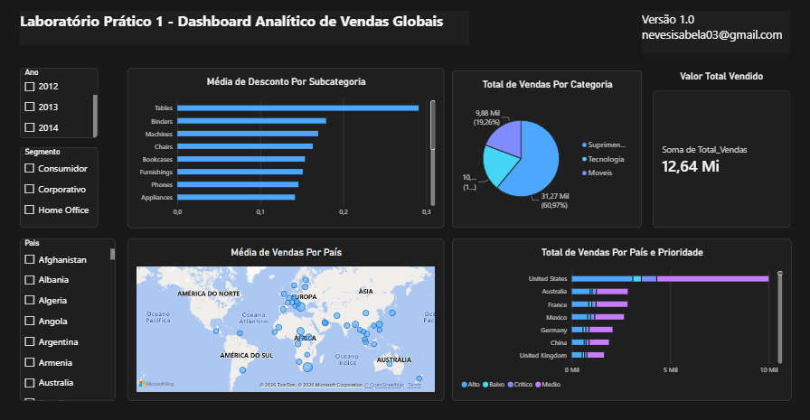

# 📊 Laboratório Prático 1 - Dashboard Analítico de Vendas Globais

Este repositório contém um relatório interativo desenvolvido no **Power BI** para análise estratégica de dados de vendas globais. O objetivo principal do projeto é responder a perguntas de negócio cruciais e oferecer visões dinâmicas para tomada de decisão.

---

## 📸 Visualização do Dashboard



> **Nota:** Certifique-se de atualizar o caminho da imagem acima (`./img/dashboard.png`) para o caminho correto do arquivo salvo no seu repositório.

---

## 🎯 Perguntas de Negócio Respondidas Através do Dashboard

1. **Qual o valor total vendido?**

2. **Quantas vendas foram realizadas por categoria de produto?**

3. **Quantas vendas foram realizadas por país considerando a prioridade de entrega?**

4. **Qual foi a média de desconto nas vendas por subcategoria de produto?**

5. **Quais países tiveram maior média de valor de venda?**


---

## 🎛️ Funcionalidades e Interatividade

O painel oferece filtros dinâmicos (*slicers*) para que o usuário navegue e explore os dados sob diferentes perspectivas:

* **Ano:** Filtragem temporal para acompanhamento de desempenho anual.
* **Segmento:** Análise segmentada por perfis de cliente (*Consumidor, Corporativo, Home Office*).
* **País:** Recorte regional específico.

---

## 🛠️ Tecnologias e Ferramentas Utilizadas

* **Power BI Desktop:** Modelagem de dados, criação de medidas DAX e visualização interativa.
* **Power Query:** Limpeza, transformação e carga dos dados (ETL).
* **Linguagem DAX:** Cálculos de agregados, médias e métricas de desempenho.

---

## 📂 Como Visualizar o Projeto

1. Baixe o repositório ou faça um clone:
   ```bash
   git clone [https://github.com/seu-usuario/seu-repositorio.git](https://github.com/seu-usuario/seu-repositorio.git)
